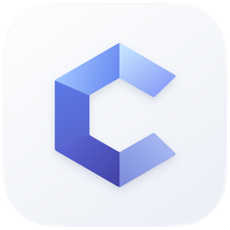
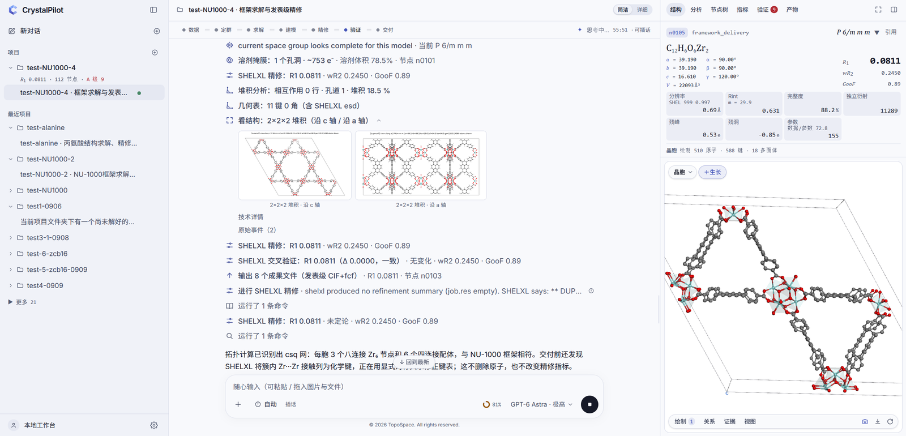
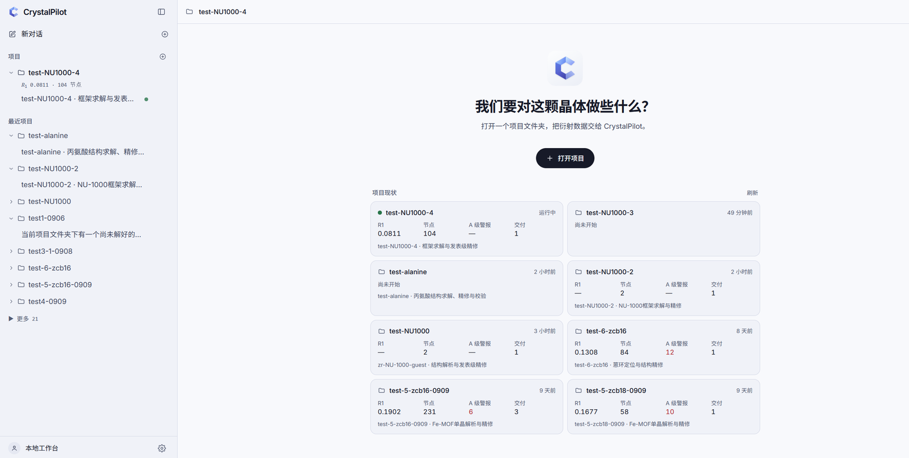
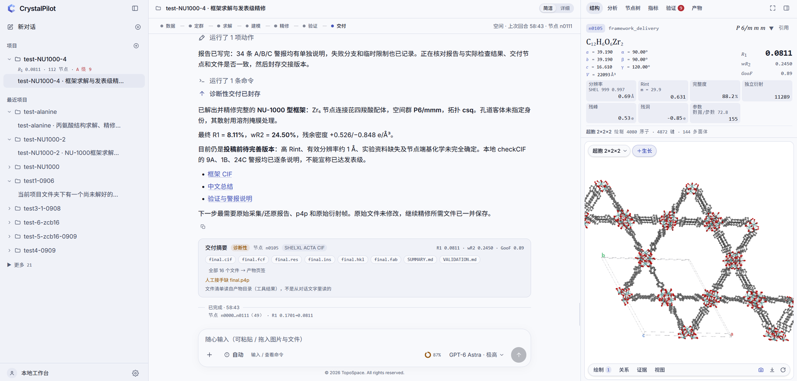

<p align="center">
  <picture>
    <source media="(prefers-color-scheme: dark)" srcset="design/CrystalPilot-logo-v1/png/crystalpilot-app-dark-256.png">
    
  </picture>
</p>

<h1 align="center">CrystalPilot</h1>
<p align="center"><strong>Development Preview</strong></p>

<p align="center">
A local workbench in which a language-model agent solves and refines single-crystal X-ray structures<br>
through typed crystallographic tools, while you watch the crystal, the node tree and the numbers change.
</p>

<p align="center">
  <a href="#what-crystalpilot-does">What it does</a> ·
  <a href="#a-session-from-start-to-delivery">A session</a> ·
  <a href="#how-it-is-built">How it is built</a> ·
  <a href="#results-measured-so-far">Results</a> ·
  <a href="#running-it">Running it</a> ·
  <a href="#documentation">Documentation</a>
</p>

<p align="center">
  
</p>
<p align="center"><sub>A live run on NU-1000 data (September 2026). Left: projects and conversations. Centre: the agent's tool rows, packing views and narration, with the stage rail on top. Right: the current node, its metrics and the structure in 3D.</sub></p>

---

## What CrystalPilot is

CrystalPilot is a program you run on your own computer. It opens a project folder that holds diffraction data and turns a language model into a working crystallographer for that folder. The model reads the data through tools, decides what to do next, calls the tools again, and explains its reasoning in the conversation. You can interrupt at any point, answer its questions, or send it in a different direction.

The model does not do any crystallographic arithmetic itself. Space-group screening, phasing, least-squares refinement, difference maps, geometry, validation and CIF assembly are performed by established engines: cctbx and smtbx in-process, SHELXT and SHELXL as external programs, PLATON for checkCIF, DIALS for raw frames. The model supplies what these programs cannot: reading a difference map as chemistry, recognising a broken ligand or a mistyped metal, deciding when a solvent region should be modelled and when it should be masked, and saying plainly what the data cannot support.

The project was written for metal-organic frameworks first, because that is what the group that built it works on. Small molecules, salts, co-crystals, cages and macrocycles run through the same tools. The interface and the agent's narration are in Chinese; the code, the tool contracts and this documentation are in English.

This is a development preview. It is used daily on real data inside one research group, it has a large test suite, and it still has rough edges that are listed below.

## What CrystalPilot does

**Takes what you have.** A project can start from a reflection file and an atom-less SHELX instruction file, from a coarse model that needs repair, from a published CIF you want to check or improve, from vendor reductions (SAINT, TWINABS, XPREP, CrysAlisPro), or from raw frames (CBF, SFRM, IMG, OSC, MCCD, HDF5), which the agent reduces with DIALS in resumable stages. A `context.json` file carries the synthesis priors a chemist knows: metal source, ligand SMILES, solvents, post-synthetic modifications, instrument details.

**Works the way a crystallographer works.** A typical run screens space groups against the unmerged data, solves with SHELXT or charge flipping, assigns elements from scattering power and coordination, matches ligand fragments against their SMILES, adds missing atoms only where the difference density supports them, sets restraints with a stated reason, decides about disorder and solvent, refines with the in-process engine and cross-checks with SHELXL, and validates with PLATON checkCIF. Every one of these steps is a named tool call with typed arguments and a structured result.

**Keeps every state.** Each model-changing tool call commits a node: the model, the restraints, the weights, the mask parameters, the hydrogen treatment and the metrics. Nodes form branches. The agent can branch to test a hypothesis, compare two branches in one table, and check out the one it prefers. Checking out a node rebuilds the live session from what is on disk, and the test suite requires the rebuilt session to reproduce the node's recorded R1. Nothing is lost when the model changes its mind, and you can see the whole history in the node tree.

**Shows you the crystal while it happens.** The right-hand pane renders the current node with 3Dmol: asymmetric unit, unit cell, grown fragments, supercells, coordination polyhedra, thermal ellipsoids, space-filling spheres, disorder parts in different colours. Overlays add difference and total density, solvent voids, residual peaks, symmetry elements, periodic slices and intermolecular interactions. An analysis tab reports topology, pore geometry, interactions, helices and shape measures for the same node. Anything you select can be quoted into the conversation, including a rendered image, so the agent sees what you see.

**Lets you steer.** While a turn runs you can send a message that reaches the model in flight, approve or reject an action, or stop. When the agent lacks a fact that would change its next step, it asks with a question card that offers options and lets you answer in your own words. Four permission modes decide how much it may do without asking, from read-only to fully automatic.

**Delivers what a crystallographer hands over.** A delivery writes `final.cif` on the SHELXL ACTA backbone with only measured or recorded metadata, `final.fcf`, `final.res`, `final.ins`, `final.hkl`, `final.p4p` when it was captured, `final.fab` when a solvent mask is active, a `REPORT.json` with the source of every file, a Chinese `SUMMARY.md`, a `VALIDATION.md` that explains every checkCIF alert of level A, B and C, and the checkCIF result itself. A delivery is sealed as final, provisional or diagnostic. A diagnostic delivery is a structure that is not ready for publication, with its open items written down, and it is still delivered rather than refused.

**Remembers what the group has learned.** Expert knowledge lives in small Markdown units under `knowledge/`. Tools compute facts; the units say how to judge them. The agent reads them on demand and can save a new one, with its source and a stated confidence, when a session produced a reusable rule.

## A session from start to delivery

<p align="center">
  
</p>
<p align="center"><sub>The project home. Every project on this machine appears on the status board with its last R1, node count, level-A alerts and deliveries.</sub></p>

1. **Open a folder.** Put `crystal.hkl` and `start.ins` (or `start.res`) into a folder outside the source tree, optionally with `context.json`. Open it from the sidebar. The server writes an `AGENTS.md` into the folder that tells the model how this workbench is operated, starts an isolated kernel for the project and loads the tool server.
2. **Describe the task.** Write what you know and what you want in the composer, in your own words, and attach files or images if you have them. A short brief is enough; the agent begins with `get_project_brief` and `situation_report` and forms its own plan.
3. **Watch and steer.** The stage rail at the top of the conversation shows which stage has been observed: data, space group, solution, modelling, refinement, validation, delivery. Tool rows summarise each call in plain language and fold out to the exact arguments and results. The right pane follows the active node.
4. **Answer when asked.** Question cards and approval cards appear inline. If you say nothing, an approval times out as rejected after fifteen minutes and the agent takes another route.
5. **Inspect the branches.** The node tree lists every branch with its head node, R1, wR2, GooF, peak height and parameter count, and marks the current, delivered and best nodes.

<p align="center">
  
</p>
<p align="center"><sub>The node tree of the NU-1000 run: eleven branches compared in one table, then the node list with the tool that created each node and where its R1 comes from.</sub></p>

6. **Take the delivery.** The delivery card lists every file and its status. Files are in `CrystalPilot Results/<task>/` inside the project folder, together with the full transcript of the session.

<p align="center">
  
</p>
<p align="center"><sub>The end of the same run. The agent delivers the Zr6 framework in P6/mmm at R1 0.0811 as a diagnostic result, states why it is not publication grade (high Rint, effective resolution around 1 Å, undetermined node capping chemistry), and lists the input it still needs from the group.</sub></p>

## The tools

The kernel sees 77 tools for a framework project. They are grouped here by what they are for. Every tool has a description and a JSON schema that the model reads before calling it, and every call is recorded in the project.

| Group | Tools |
|---|---|
| Orientation | `get_project_brief`, `situation_report`, `set_investigation`, `set_experiment`, `list_skills`, `read_skill`, `save_skill`, `delete_skill` |
| Data | `audit_reflection_data`, `reflection_statistics`, `screen_space_groups`, `estimate_resolution`, `set_resolution_limit`, `swap_reflection_data`, `ingest_vendor_data`, `import_cif_model`, `export_twin_hklf5` |
| Raw frames | `import_frames`, `find_spots`, `index_frames`, `integrate_frames`, `scale_and_export`, `create_start_model`, `reduce_with_crysalis` |
| Symmetry | `check_symmetry`, `change_space_group`, `assemble_asu`, `ncs_audit`, `set_twin`, `invert_structure`, `set_z` |
| Solution | `run_shelxt`, `solve_charge_flipping`, `solve_superflip`, `interpret_peaks`, `fourier_complete` |
| Looking at the model | `inspect_model`, `inspect_map`, `view_structure`, `get_geometry`, `analyze_packing`, `integrate_difference_density`, `check_ligand`, `compare_nodes`, `list_nodes` |
| Element and guest evidence | `audit_element_assignment`, `audit_heavy_sites`, `audit_guest_evidence`, `element_scan`, `ghost_test`, `probe_site` |
| Editing the model | `edit_atoms`, `add_atoms_from_difference_map`, `fit_fragment`, `search_fragment_pose`, `accept_fragment_pose`, `rename_atoms`, `model_disorder`, `set_adp`, `set_afix`, `set_site_occupancy`, `add_hydrogens`, `solvent_mask` |
| Refinement | `refine`, `run_shelxl`, `run_olex2`, `set_restraints`, `preflight_restraints`, `set_weights`, `optimize_weights` |
| Branches | `branch`, `checkout` |
| Validation and delivery | `validate_structure`, `run_checkcif`, `submit_iucr_checkcif`, `write_outputs`, `finalize_delivery` |
| Consultation | `consult_specialist` (off by default; five read-only reviewer roles in a nested workbench) |

Long computations return early with what they have. SHELXT can run detached: the tool returns at once, a watchdog enforces the time budget by stage, and the workbench shows the job's stage in the conversation and on the stage rail until it finishes, even after the turn that started it has ended.

## How it is built

```
browser ── React workbench (ui/)            three panes, SSE live channel, REST
   │
FastAPI service (server/, crystalpilot/workbench/)
   │   one ProjectSession per open folder: kernel process, transcript, channels,
   │   approvals, background-job watcher, scene service for the 3D pane
   │
Codex app-server kernel (vendor/codex, isolated codex-home/)
   │   threads, turns, sandbox, steer, JSON-RPC over stdio
   │
MCP tool server (crystalpilot/mcp)          one process per project
   │   77 typed tools, read-only hints, server-side permission gate
   │
crystalpilot.refine                          RefineProject + NodeStore
   │
cctbx / smtbx · SHELXT · SHELXL · PLATON · olex2.refine · DIALS · RDKit · gemmi · Systre
```

**Kernel and agent.** The agent runs on the OpenAI Codex CLI's app-server, installed from npm into `vendor/codex` and driven over JSON-RPC by the `openai-codex` Python SDK. It uses its own `codex-home/` inside the repository and never touches a user's personal Codex configuration. Any model behind an OpenAI-compatible Responses API can be used; the provider, model and reasoning effort are chosen per project in the settings dialog, and keys are stored in `secrets/` and fetched on demand by a helper the kernel calls, so they never appear in configuration files, environment variables or logs. A probe script checks a copy of the configuration and a real turn against a new kernel binary before the update script switches to it.

**The operating procedure.** Each project folder receives an `AGENTS.md` generated from a template in `crystalpilot/workbench/agents_md.py`. It tells the model which tools exist, that every change to the model must go through them, how the delivery chain is ordered, and which claims it may not make: no atom without density evidence, no silent space-group change, no invented metadata, no report number that differs from the final node. A second template with the operating contract only exists for ablation experiments on how much the knowledge layer contributes.

**Tool server.** `crystalpilot/mcp` is a stdio MCP server that exposes the tool registry to the kernel. Tool results are structured dictionaries, so the UI can render a tool row from the same data the model sees. The server enforces the project's permission mode itself: in read-only mode a writing tool is refused inside the tool process, independent of the kernel's sandbox.

**Engines.** `refine` runs smtbx least squares in-process with a restraints manager built from SHELX-style specifications (DFIX, DANG, SADI, FLAT, SIMU, DELU, RIGU, ISOR). `run_shelxl` writes a complete `.ins` from the same state, runs SHELXL 2019/3, parses the result and either reports agreement or adopts it as a new node. `run_olex2` does the same with olex2.refine as a third opinion. `run_shelxt` drives SHELXT 2018/2 with a stage-aware budget and adopts the solution it selects. Space-group screening, absence tests, E-statistics, ADDSYM-style symmetry audits, difference-map integration and reflection audits are cctbx code in `crystalpilot/refine` and `crystalpilot/tools`. Disorder (PART, FVAR), twinning (TWIN, BASF, HKLF 5) and riding hydrogens are carried as first-class state from the SHELX parser through every node into every job.

**Project state on disk.** Everything a project knows lives under its own folder. `.crystalpilot/refine/` holds the node store, the reflection-data revisions (stored once and hard-linked into jobs), the SHELXL, SHELXT and checkCIF job directories and the per-node analysis cache. `CrystalPilot Results/<task>/` holds the transcript and the deliveries. The kernel keeps its conversation state under `codex-home/`, but everything scientific about a project lives in the folder, so a folder can be copied, archived or opened on another machine.

**Web service and interface.** The FastAPI service serves the built React interface and a REST plus server-sent-events API. Events flow from the kernel through a normaliser into a per-thread transcript and a live channel; the browser replays the transcript on load and then follows the channel, with reconnection, gap detection and a heartbeat watchdog. The interface is React 18 with TypeScript, Vite and Tailwind; the 3D pane is 3Dmol.js fed by a scene service that instances symmetry copies, closes bonds across the cell boundary and caches per node.

**Knowledge units.** `knowledge/skills/` and `knowledge/expert-cases/` hold short Markdown units: how to read a reflection audit, when a solvent mask is legitimate, how to treat a framework twin alarm, how to respond to a reviewer. checkCIF results attach the units that match their alert codes. The units are versioned with the code and can be edited by anyone in the group.

**Tests.** About 2,850 pytest tests cover the engines, the tools, the node store, the service and the delivery chain, many of them against real diffraction data kept outside the repository. The interface has 580 unit tests and a set of Playwright specifications that run against a real server on a copy of a real project.

## Results measured so far

These are the runs that were evaluated against a human reference or a hard gate. They are dated because the code keeps changing.

| Case | Date | Outcome |
|---|---|---|
| SJTU-9, a Zr-MOF whose coarse model was deliberately damaged in three places (wrong element, broken aromatic ring, missing μ3-O) | 2026-08 | All three defects found and repaired from the priors "ZrCl4 + H4TCPB" alone. Final R1 0.0615 against 0.0617 for the human refinement; wR2 0.2002 against 0.2048; atom match 1.0/1.0; SHELXL cross-check R1 0.0611. Every checkCIF alert explained. |
| L-cysteine, 1,700 CBF frames from Diamond I19 | 2026-08 | Reduced with the staged DIALS tools (CC½ 0.998, Rmerge 0.055, completeness 95.8 %), solved in P2₁2₁2₁, refined to R1 about 0.050. |
| Import fidelity, nine published structures | 2026-08 | Gate: SHELXL with zero cycles on the imported model must reproduce the published R1 within 0.005. Eight of nine pass; the twin cases agree within 0.0005. Five importer bugs were found and fixed by this gate. |
| Twin trap, COD 2229074 | 2026-08 | The agent showed from the deposited structure factors that the published R1 cannot be reproduced, recomputed R1 0.0526 consistent with the deposit, and declined to add restraints to chase the paper's number. |
| Coarse-solve pipeline, 33 structures | 2026-08 | 75.8 % solved without a model; space group correct at rank 1 in 87.9 %. |
| NU-1000 with a post-synthetic bromophenylacetate modification, synchrotron data | 2026-09 | Framework solved and refined in P6/mmm to R1 0.0811 (screenshots above); delivered as diagnostic with the reasons stated. The pore guest was not identified in this data and its scattering was treated with a solvent mask. |

## Status of this preview

Working and in daily use: the refinement workbench with the tools listed above, the node store, the three-pane interface, four permission modes, publication CIF assembly on the SHELXL ACTA backbone, local checkCIF with per-alert explanation, disorder and twin handling, the staged raw-frame chain, background solver jobs, reflection-data versioning and storage cleanup.

Known limits: the interface is Chinese only; Windows is the primary platform and Linux is supported as a server install; SHELXL, SHELXT and PLATON must be obtained under their own licences and are not shipped; the frame-stage twin rescue on non-merohedral twins is still being tested; disorder with three or more sites is modelled by hand; powder data, incommensurate structures and proteins are out of scope.

Recent investigations are written up in `docs/REVIEW-*.md`. The latest one traces two runs that appeared to stall to a SHELXT space-group search that was invisible in the interface, and describes the fix.

## Running it

### Requirements

- Windows 10 or 11, or Linux x86_64.
- Python 3.11 or newer. The scientific stack is `cctbx-base` 2025.9 or newer, `gemmi`, `rdkit`, `numpy`, `scipy`; the service uses FastAPI and uvicorn.
- Node.js 22 to build the interface.
- Licensed copies of SHELXL and SHELXT, and PLATON for local checkCIF. The setup script copies them into `vendor/shelx/`, which is not tracked.
- Optionally a DIALS conda environment under `vendor/dials` for raw frames, and Java with Systre for topology symbols.
- Access to a model through an OpenAI-compatible endpoint, entered in the settings dialog.

### Windows

```bash
python -m venv .venv
.venv/Scripts/pip install -e .[server,workbench,refine,dev]
python scripts/setup_vendor_shelx.py --source <folder with your licensed SHELX programs>
powershell -NoProfile -ExecutionPolicy Bypass -File scripts/update_codex_kernel.ps1
cd ui && npm install && npm run build && cd ..
powershell -NoProfile -ExecutionPolicy Bypass -File scripts/restart_server.ps1
```

The restart script is the supported way to start or restart the service. It runs the server detached from the shell, waits for the health endpoint, and pins uvicorn to the selector event loop, because the default Windows loop closes its listening socket after a single failed accept. The interface is then at `http://127.0.0.1:8010` and the health endpoint at `http://127.0.0.1:8010/api/health`.

### Linux

See [docs/INSTALL-LINUX.md](docs/INSTALL-LINUX.md) for the locked dependency set, the isolated kernel installation, the vendor programs and the detached server commands.

### Providers and keys

`codex-home/config.toml` in the repository is a template with two example providers and no project trust entries. The service edits the working copy as you use it, so keep it out of your commits with `git update-index --skip-worktree codex-home/config.toml`. Open the settings dialog from the gear in the sidebar. Add a provider with its base URL, paste the key, test the connection and set it as default or as the provider for the current project. The key is written to `secrets/<provider>.txt` on this machine only. The model and reasoning effort are picked from the model button under the composer and take effect on the next message.

### A first test

The user guide, [docs/USER-GUIDE-2026-09-06.md](docs/USER-GUIDE-2026-09-06.md), walks through the interface and lists the data sets the group uses for self-tests. `scripts/run_live.py` creates a project from a data folder, writes the priors, sends a brief and prints the URL to watch.

## Repository layout

| Path | Contents |
|---|---|
| `crystalpilot/refine/` | RefineProject, NodeStore, reflection-data versions, restraints, and the tool modules (`tools_*.py`) that make up the workbench |
| `crystalpilot/tools/`, `crystalpilot/pipeline/` | Engine-level tools and the deterministic coarse-solve route |
| `crystalpilot/mcp/` | The MCP server that exposes the tool registry to the kernel |
| `crystalpilot/workbench/` | Kernel harness, project sessions, event normalisation, approvals, background jobs, the `AGENTS.md` template |
| `crystalpilot/io/` | SHELX reader and writer, CIF handling, DIALS driver and frame-format plug-ins |
| `crystalpilot/chem/` | Bonding, coordination, pores, topology, interactions, guest analysis |
| `crystalpilot/report/` | Publication CIF assembly, checkCIF knowledge base, deliverable files |
| `crystalpilot/benchmark/` | Corruption presets, evaluators and campaign reports |
| `knowledge/` | Expert knowledge units read by the agent |
| `server/`, `ui/` | FastAPI application and the React interface |
| `scripts/` | Setup, kernel update, server restart, live test runner |
| `tests/` | pytest suite |
| `docs/` | User guide, installation, architecture notes, reviews and audits |
| `design/` | Logo sources and exports |
| `vendor/` | Kernel, SHELX programs and DIALS environment; not tracked |

`ARCHITECTURE.md` describes the layers in more depth and keeps a dated record of what changed.

## Data handling

Diffraction data, frames, models and deliveries stay on the machine that runs the service. What reaches the model provider is the conversation: the text you write, the structured summaries the tools return, and images only when you attach one or when the agent asks `view_structure` for a rendering. Uploading a CIF to the IUCr checkCIF service is off by default and, when enabled for a project, still requires approval for every call. Original data files are never modified; the tools work on copies inside the project folder.

## Documentation

- [docs/USER-GUIDE-2026-09-06.md](docs/USER-GUIDE-2026-09-06.md): the interface, controls, settings, test data and troubleshooting (Chinese).
- [docs/INSTALL-LINUX.md](docs/INSTALL-LINUX.md): server installation on Linux.
- [ARCHITECTURE.md](ARCHITECTURE.md): layers, contracts and the dated change record.
- [docs/CAPABILITIES-2026-09.md](docs/CAPABILITIES-2026-09.md): the analysis capabilities and how each was verified.
- `docs/REVIEW-*.md`, `docs/AUDIT-*.md`: investigations of real sessions and periodic audits.

## Acknowledgements

CrystalPilot stands on SHELXT and SHELXL by George M. Sheldrick, PLATON by Ton Spek, the cctbx and smtbx libraries, DIALS, olex2.refine, RDKit, gemmi, Systre and the RCSR nomenclature, 3Dmol.js, and the OpenAI Codex CLI. The conventions of Olex2 guided many interface decisions.

## License

CrystalPilot is released under the [CrystalPilot Non-Commercial Academic License](LICENSE). Non-profit academic and research use is permitted. Commercial use of any kind is not permitted without a written agreement with TopoSpace. Modifying the software beyond what is needed to install and run it, building on it, or redistributing it requires prior written authorization from TopoSpace. The vendor programs remain under their own licences and are not part of this repository.
