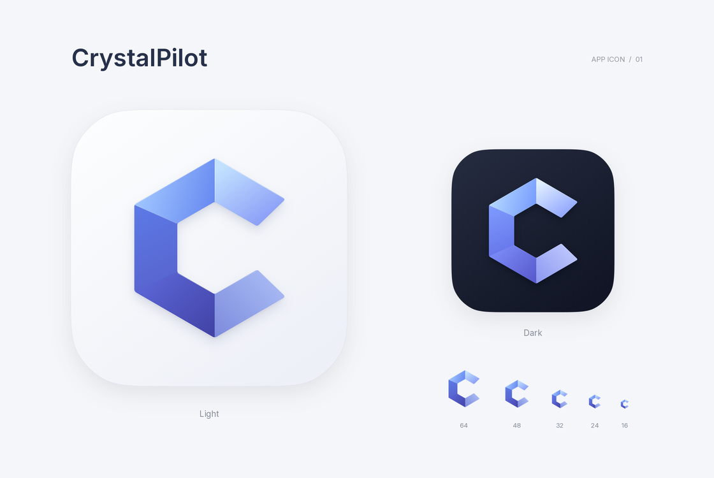

# CrystalPilot Logo · v1

以晶体切面组成开放的字母 C。五个宽切面呈现从冰蓝到靛蓝的柔和光感，保留清晰的内外轮廓；珍珠白底色与连续圆角使它适合作为桌面 App 图标。深色版使用同一几何结构，并调整切面亮度。

这是直接绘制的矢量图形；不含文字、外部图片或字体依赖。所有 PNG 与桌面格式均从同一组 SVG 导出。



[下载完整素材与源文件包](CrystalPilot-logo-v1.zip)

## 文件使用

| 文件 | 用途 |
| --- | --- |
| `svg/crystalpilot-app-light.svg` | 推荐的浅色 App 图标，透明圆角外部 |
| `svg/crystalpilot-app-dark.svg` | 深色 App 图标 |
| `svg/*-square.svg` | 完整方形底图，由平台应用图标遮罩 |
| `svg/crystalpilot-symbol.svg` | 透明底彩色标志，适合界面与品牌排版 |
| `svg/crystalpilot-monochrome.svg` | 单色标志；内联 SVG 时以 `color` 控制颜色，默认黑色 |
| `png/` | 2048、1024 及常用小尺寸 PNG；方形底图为不透明 RGB |
| `desktop/CrystalPilot-light.ico` | Windows 图标，包含 16–256 px 多尺寸 |
| `desktop/CrystalPilot-light.icns` | macOS 图标，包含适当的桌面图标外边距 |
| `desktop/CrystalPilot-dark.*` | 对应深色桌面图标 |
| `desktop/favicon.ico` | 无底板的透明标志，适合浏览器小尺寸显示 |
| `source/` | 矢量生成、PNG 渲染、桌面格式导出脚本与初始尺寸检查图 |

网页界面优先使用 SVG。由系统统一裁切圆角的平台使用 `square` 版本；通用展示使用已经带圆角的版本。保持宽高比，不额外添加描边或强阴影。

主色范围：冰蓝 `#c3e2ff`、蓝 `#6586f0`、靛蓝 `#4242a5`；浅底 `#fdfefe` → `#edf0f7`；深底 `#262d40` → `#111525`。

已检查 SVG 解析、PNG 尺寸与透明度、ICO/ICNS 读取，以及 16–128 px 缩小效果。

## 重建素材

使用 Python 3.10 或更新版本与项目支持的 Node.js。成品文件可直接使用，无需安装依赖。重新绘制或导出时，在仓库根目录依次运行：

```sh
python -m venv design/CrystalPilot-logo-v1/.venv
```

Linux/macOS 使用 `source design/CrystalPilot-logo-v1/.venv/bin/activate` 激活；Windows PowerShell 使用 `design/CrystalPilot-logo-v1/.venv/Scripts/Activate.ps1` 激活。随后运行：

```sh
python -m pip install -r design/CrystalPilot-logo-v1/source/requirements.txt
npm --prefix ui ci
```

进入 `ui` 目录执行 `npx playwright install chromium`，然后返回仓库根目录：

```sh
python design/CrystalPilot-logo-v1/source/build_vectors.py
node design/CrystalPilot-logo-v1/source/render.mjs
python design/CrystalPilot-logo-v1/source/export_assets.py
```

脚本依次生成 SVG、渲染 2048 px PNG、导出各尺寸与桌面图标，最后校验并打包。预览板使用 UI 已有的 Inter 字体；图标本体没有字体依赖。

脚本默认从本仓库的 `ui/node_modules` 读取 Playwright 和 Inter。单独解压素材包运行时，可通过 `PLAYWRIGHT_MODULE` 指定已安装的 `@playwright/test` 模块目录，通过 `INTER_FONT_PATH` 指定 `inter-latin-wght-normal.woff2`；也可通过 `CHROME_EXECUTABLE` 指定本机 Chrome/Chromium 可执行文件。这些配置均为文件路径。

© 2026 TopoSpace. All rights reserved.
